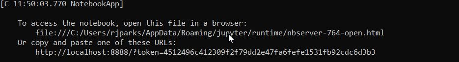
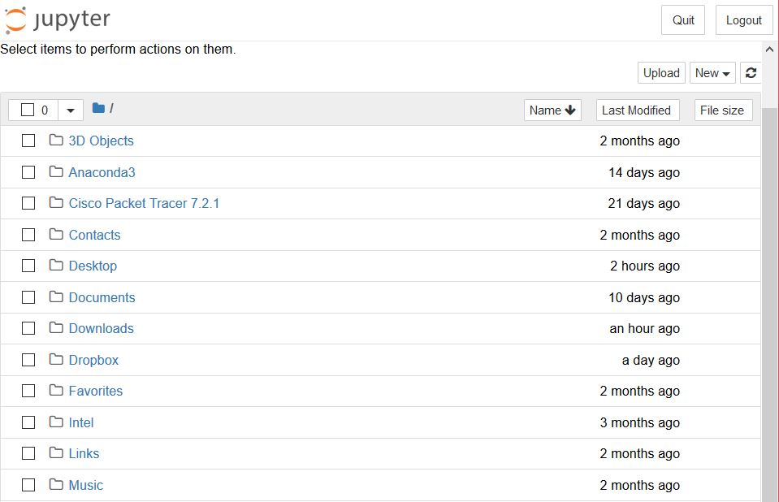
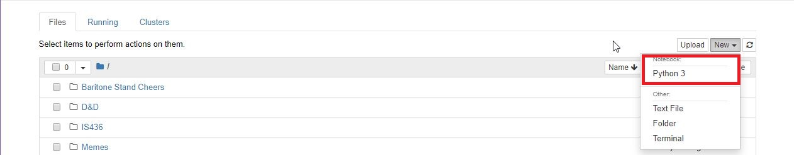

= Learning Python with Jupyter

Author: RJ Parks

== Context

We will be using Jupyter to help show people who are learning python by having it run in a web browser

== Prerequisites

* https://www.python.org/downloads/[Python 3.7] or
* https://www.anaconda.com/distribution/[Anaconda] Distribution (Recommended)
* A python file with edit permissions

Jupyter uses the Anaconda Distribution but because it is created with python it will work with the python command line interface.


== Installation

* Python 3.7 +
Run the Following Commands:
```
python3 -m pip install --upgrade pip
python3 -m pip install jupyter
```
Python 2 is supported but not recommended. Python 2 commands are as follow:
```
python -m pip install --upgrade pip
python -m pip install jupyter
```
* Anaconda +
Run the Installer that was downloaded. +
All defaults are fine, feel free to change the path if needed.

== Start Up
Starting Jupyter. +
In order to start Jupyter, you will need to launch it from the Terminal or Command Prompt by running the following command: 

```
jupyter notebook
```

Once launched, you will need to open a web browser and go to one of the links specified in your cmd/terminal. 



here is an example of what you should see when it is launched. 



== Using the Notebook. +
Once Launched, you can navigate your C:\ folder to locate a python file and open it, Or create a new Notebook +
NOTE: if you did not launch jupyter notebook from c:\ folder in your cmd/terminal you can only go up to the folder of it was launched. Nothing above it.



Editing existing files with Jupyter. +
Once opened, you can edit your source code right in the interface. You can save by using Control + S or going to the File Menu and clicking save. However to be able to run code in Jupyter, you must make a notebook.

Understanding the Notebook. +
Each notebook has cells. A cell in Jupyter can be viewed as a container. Each container can have as few as one variable or as much as the entire program. +

 

Each cell can be in one of two modes: +
* Cell Edit Mode 
* Notebook Edit Mode
 
Cell Edit mode is denoted by the green bar, where Notebook Edit mode is denoted by a blue bar. You are unable to edit any cell in Notebook Edit Mode. To enable cell edit mode, just click in the cell you wish to edit.

== Reflection
Provide some thought questions that help the learner make sense of how the tutorial fits in the bigger picture.

