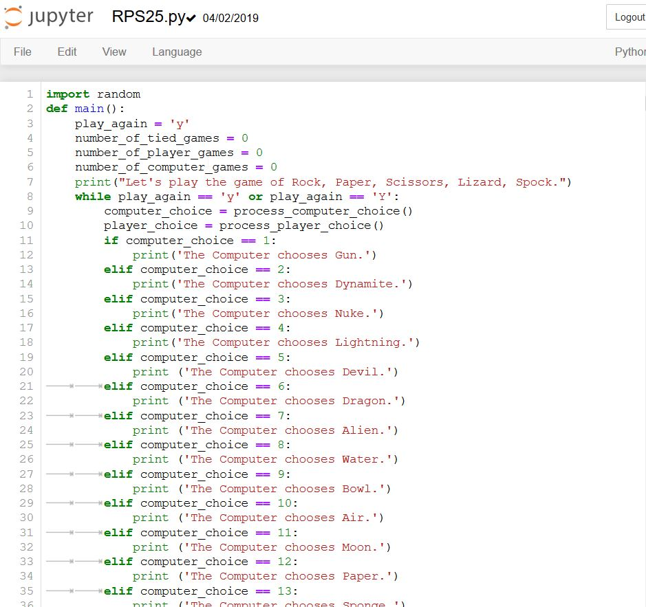

= Learning Python with Jupyter

Author: RJ Parks

== Context

We will be using Jupyter to help show people who are learning python by having it run in a web browser

== Prerequisites

* https://www.python.org/downloads/[Python 3.7] or
* https://www.anaconda.com/distribution/[Anaconda] Distribution (Reccomended)
* A python file with edit permissions

Jupyter uses the Anaconda Distribution but because it is created with python it will work with the python command line interface.


== Installation

* Python 3.7 +
Run the Following Commands:
```
python3 -m pip install --upgrade pip
python3 -m pip install jupyter
```
Python 2 is supported but not recommended. Python 2 commands are as follow:
```
python -m pip install --upgrade pip
python -m pip install jupyter
```
* Anaconda +
Run the Installer that was downloaded. +
All defaults are fine, feel free to change the path if needed.

== Instructions
. Running Jupyter
In order to start Jupyter, you will need to launch it from the Terminal or Command Prompt by running the following command: +
+
```
jupyter notebook
```
. Once launched, you will need to open a web browser and go to one of the links specified in your cmd/terminal. 
+
image::cmdfiles.jpg[command line links]
+
here is an example of what you should see when it is launched. 
+
image::jupyterweb.jpg[jupyter notebook web interface]

. Using the Notebook
Once Launched, navigate your C:\\ folder to locate a python file. +
And open it.
+


. Editing with Jupyter Notebooks
Once opened, you can edit your source code right in the interface. 

== Reflection
Provide some thought questions that help the learner make sense of how the tutorial fits in the bigger picture.

